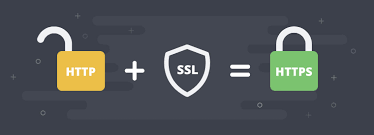
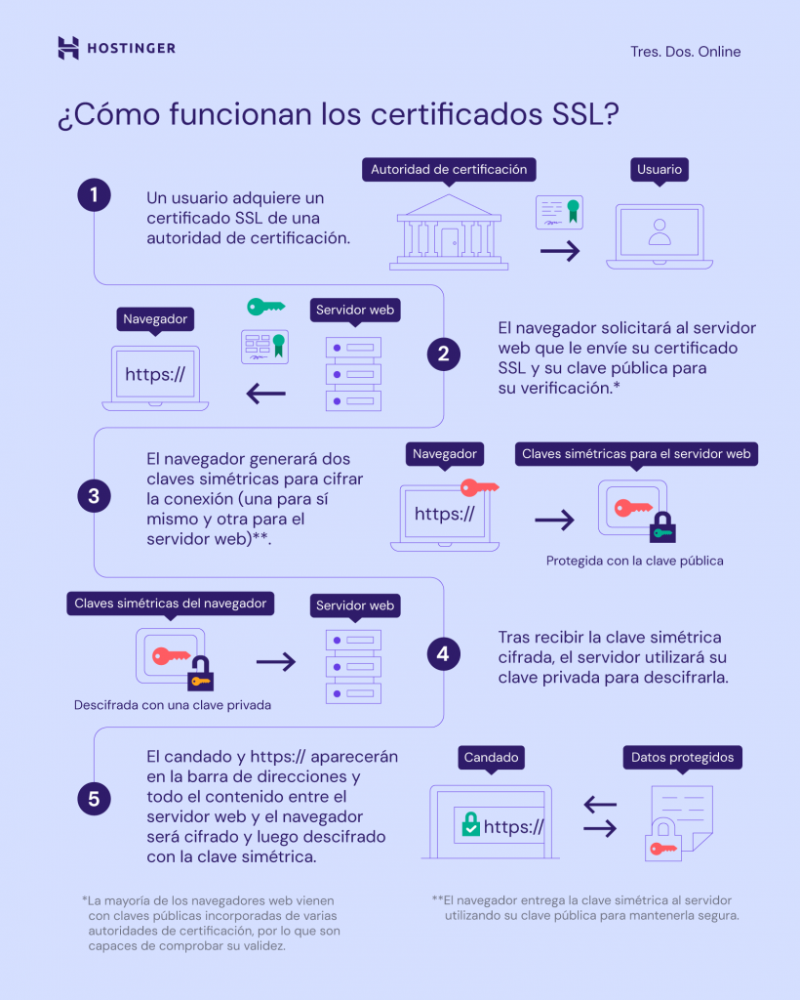
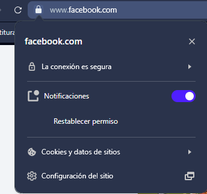
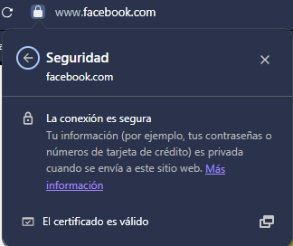

🏁 **Desafío de Investigación**
============================

## **🔹 1. Diferencia entre HTTP y HTTPS**

**HTTP** significa *HyperText Transfer Protocol*. Es el **protocolo** o *"lenguaje comun"* que permite la comunicación entre un navegador web y un servidor para cargar páginas en internet principalmente.
La desventaja de HTTP es que no cifra los datos transmitidos, entonces toda la información enviada como contraseñas o datos personales puede ser interceptada con facilidad.
Por otro lado, HTTPS significa *HyperText Transfer Protocol **Secure***. Es una version segura y mejorada de HTTP, usa los protocolos de **SSL/TLS**, sistema que protege la información que se envía entre un navegador y servidor haciendo que los datos viajen codificados y sean ilegibles para terceros. De esta manera, los datos que viajan entre el usuario y servidor se envían en forma cifrada, evitando que terceros puedan leer o modificar la comunicación.

### 🔐 Cifrado SSL/TLS en HTTPS
**TLS** es la *seguridad de la capa de transporte*, un protocolo criptográfico que asegura la conexión entre un servidor web y una aplicación por medio del cifrado de datos y se aplica a todos los datos. De esta forma los datos sensibles como credenciales de acceso, números de tarjeta, etc, quedan protegidos para que terceros no puedan interceptarlos.

La capa de *sockets seguros* (SSL) es una versión antigua de TLS. Ambos protocolos de seguridad funcionan practicamente de forma similar, sin embargo TLS tiene algoritmos de cifrado más robustos y suites más seguras, por lo que garantiza la privacidad de los datos y autenticación que SSL.

Ambos terminos suelen utilizarse indistintivamente ya que TLS se lanzó como una actualización a SSL 3.0.

Los certificados *SSL/TLS* protegen la transferencia de datos mediante tecnicas de cifrado simetrica y asimetrica. 

Un resumen del proceso:

1️⃣ El dueño de un sitio web compra un certificado SSL y lo instala en su servidor.

2️⃣ Cuando alguien visita el sitio, el navegador y el servidor hacen un “apretón de manos” SSL (SSL handshake) para ponerse de acuerdo en cómo comunicarse de forma segura.

3️⃣ Durante este proceso, el navegador pide el certificado y la clave pública del servidor para comprobar que es confiable.

4️⃣ Una vez verificado, el navegador y el servidor crean una clave de sesión secreta usando las claves pública y privada.

5️⃣ A partir de ese momento, toda la información que se envía se cifra con esa clave, y solo el navegador y el servidor pueden leerla. Esta clave solo sirve para esa sesión y se elimina cuando se cierra la conexión.

### ✅ ¿Por qué HTTPS es más seguro?

HTTPS es más seguro porque garantiza confidencialidad, **autenticidad e integridad de la información.** Además, los navegadores muestran un candado en la barra de direcciones cuando un sitio usa HTTPS, indicando que la conexión es segura.
### 🔒 Ejemplo visual del candado en el navegador
Asi se ve un sitio seguro:

### ⚠️ ¿Qué sucede si un sitio no usa HTTPS?
Los sitios web sin certificado SSL/TLS funcionaran con HTTP transfiriendo datos en texto plano quedando vulnerables a que cualquiera en internet los pueda interceptar, existiendo un mayor riesgo de robo de datos y ataques como el pishing (fraude digital).

De todas formas, cuando un sitio no utiliza HTTPS, los navegadores suelen mostrar advertencias como “Sitio no seguro”, haciendo que la gente evite los sitios que no son seguros.

------------------------------------
## **🔹 2. Puertos de comunicación**

### 🔌 ¿Qué es un puerto de comunicación y por qué es importante para HTTP?

Un puerto es un punto virtual en el que comienzan y terminan las conexiones de red. Los puertos estan basados en software y los gestiona el sistema operativo de los computadores. 
Cada puerto esta asociado a un proceso o servicio específico, permitiendo distinguir los diversos tipos de tráfico como correo o páginas web aunque lleguen desde una misma conexión de internet. 
Los puertos estan estandarizados en todos los dispositivos que se conectan a redes, cada uno tiene un número asignado.

> **💡 Explicado de otra forma:** 
>
>Tu computador es como un **edificio gigante de departamentos**:
>
> - La **dirección del edificio** = la **IP** de tu computador. 
> - Cada **departamento** = un **puerto** (0 a 65535), donde vive un servicio o aplicación.
>
> **Ejemplos de departamentos:**
> - 🕸️ **80** → Servidor web (HTTP)  
> - ✉️ **25** → Correo electrónico (SMTP)  
> - 📂 **20 y 21** → Transferencia de archivos (FTP)  
> - 🌐 Departamentos para tus propios servidores locales (8080, 8081…)
>
> **Reglas de ocupación:**
> - **0-1023** → “departamentos principales”, para servicios estándar, requieren permisos especiales.  
> - **1024-49151** → “departamentos registrados”, usados por aplicaciones comunes.  
> - **49152-65535** → “departamentos dinámicos”, ocupados temporalmente como habitaciones de Airbnb.
>
> **Cómo funciona:**
> Cuando llega una carta (mensaje) se envía a la IP del edificio **y al departamento correcto**.  
> Si el departamento está ocupado por la aplicación correcta, la carta se procesa; si no, se ignora.  
> Los puertos no estándar se usan a veces por comodidad o seguridad, como poner la bóveda del banco en un departamento menos obvio.
>
> 💡 Todos los datos viajan por el mismo cable; el puerto solo indica **quién recibe qué**.

### 🚪 Los puertos 80 y 8080

El **puerto 80** es el predeterminado del protocolo HTTP y permite que los navegadores soliciten y reciban páginas web desde los servidores, aunque no ofrece seguridad porque el tráfico viaja sin cifrar. Por esto, para que la navegación sea segura se usa el puerto 443 con HTTPS.

Por otro lado el **puerto 8080** se usa como una alternativa al 80, especialmente en servidores de desarrollo, aplicaciones web locales o proxies (servidores intermediarios. Más información, leer abajo) puesto que el 80 puede requerir permisos de administrador o estar ocupado. Al igual que el 80, tampoco es seguro por defecto, también usa HTTP sin cifrado, aunque es posible configurarlo para comunicaciones seguras si se necesita.

Ejemplo:

>🔌 **Proxy**
>Los proxies son servidores intermediarios que actuan como una puerta de enlace entre el dispositivo e internet redirigiendo las solicitudes. En lugar de conectarse directamente con un sitio web pasa primero al servidor proxy que puede filtrar contenido, mejorar la seguridad, enmascarar la dirección IP y almacenar el caché para acelerar la carga.

>  #### 👁️ ¿Se pueden filtrar conexiones en el puerto 80?
> Afortunadamente **sí**. Esto se hace a través de Firewalls, Routers, Sistemas de detección y prevención de intrusos (IDS/IPS) y aplicaciones de seguridad en el servidor. 
> Un firewall puede bloquear todo el tráfico entrante al puerto 80, puede permitir sólo tráfico hacia ciertas páginas, bloquear las IP sospechosas y redirigir al puerto 443.
### 🚢 Otros puertos conocidos

| Puerto | Servicio / Aplicación | Descripción |
|--------|---------------------|-------------|
| **20** | FTP *(File Transfer Protocol)* (Data) | Transferencia de datos en FTP |
| **21** | FTP *(File Transfer Protocol)* (Control) | Control para transferencias FTP |
| **22** | SSH *(Secure Shell)* | Acceso remoto **seguro** a servidores |
| **23** | Telnet *(Telecommunication Network)* | Acceso remoto **no seguro** |
| **25** | SMTP *(Simple Mail Transfer Protocol)* | Envío de correos electrónicos |
| **53** | DNS *(Domain Name System)* | Traduce nombres de dominio a IP |
| **67/68** | DHCP *(Dynamic Host Configuration Protocol)* | Asignación automática de direcciones IP |
| **69** | TFTP *(Trivial File Transfer Protocol)* | Transferencias simples sin autenticación |
| **80** | HTTP *(HyperText Transfer Protocol)* | Navegación web sin cifrado |
| **110** | POP3 *(Post Office Protocol v3)* | Recepción de correos (descarga al dispositivo) |
| **123** | NTP *(Network Time Protocol)* | Sincronización de hora entre dispositivos |
| **143** | IMAP *(Internet Message Access Protocol)* | Gestión de correos en el servidor |
| **443** | HTTPS *(HTTP Secure)* | Navegación web **cifrada** |
| **3306** | MySQL *(My Structured Query Language)* | Conexiones a base de datos MySQL |
| **3389** | RDP *(Remote Desktop Protocol)* | Escritorio remoto en Windows |
| **5432** | PostgreSQL *(Post Ingres)* | Conexiones a base de datos PostgreSQL |
| **6379** | Redis *(Remote Dictionary Server)* | Base de datos en memoria |
| **8080** | HTTP Alternativo *(HyperText Transfer Protocol Alternative)* | Alternativa para desarrollo y proxies |

## 🛡️ Puerto 443 - Guardián de la navegación segura

El **puerto 443** es el puerto estándar para HTTPS (HyperText Transfer Protocol Secure), que es la versión cifrada del protocolo HTTP.
Su función principal es permitir que los navegadores web y los servidores se comuniquen de forma privada y protegida.

------------------------------------

## **🔹 3. Códigos de estado de respuesta HTTP**

Los códigos de estado HTTP son códigos numéricos que envía un servidor al navegador para indicar el resultado de una solicitud.
Son parte del funcionamiento web y ayudan a entender si una página se cargó correctamente (qué ocurrió con la solicitud).

Son cinco clases de respuesta:
1️⃣ Respuestas informativas (100–199),
2️⃣ Respuestas satisfactorias (200–299),
3️⃣ Redirecciones (300–399),
4️⃣ Errores de los clientes (400–499),
5️⃣ y errores de los servidores (500–599).

### 🏷️ Categorías de Códigos de Estado HTTP

| Categoría | Rango | Significado | Ejemplos comunes | Explicación breve |
|----------|-------|-------------|-----------------|------------------|
| **1xx** | 100–199 | Informativos ℹ️ | 100 Continue, 101 Switching Protocols | Indican que la solicitud se está procesando y el cliente debe esperar |
| **2xx** | 200–299 | Éxito ✅ | 200 OK, 201 Created, 204 No Content | Confirmación de que la solicitud fue recibida y procesada correctamente |
| **3xx** | 300–399 | Redirección 🔁 | 301 Moved Permanently, 302 Found, 304 Not Modified | El cliente debe realizar una acción adicional (normalmente seguir otra URL) |
| **4xx** | 400–499 | Error del cliente ⚠️ | 400 Bad Request, 403 Forbidden, 404 Not Found | El cliente hizo una solicitud incorrecta o no tiene permisos |
| **5xx** | 500–599 | Error del servidor ❌ | 500 Internal Server Error, 502 Bad Gateway, 503 Service Unavailable | El servidor falló al procesar la solicitud |

### 🩺 **200, 404 y 500** ¿Por qué debemos conocer estos tres códigos en especial?

Conocer estos tres código es fundamental ya que nos informan sobre el estado de la comunicación entre el cliente y el servidor, podemos saber que pasó con la solicitud. De esta manera podemos **diagnosticar** si la solicitud que exitosa (200 OK), si el problema es la falta del recurso solicitado (404 Not Found), o si el problema esta en el servidor (500 Internel Server Error) y resolver los problemas de forma eficiente.

### 🛠️ ¿Cómo los usaría para diagnosticar problemas en una API?

**220 OK:**
Es una señal de que salió todo bien, la solicitud fue manejada correctamente y el resultado es el esperado. La API responde bien.

**404 Not Found:**
Señala que el recurso no existe en la dirección especificada. El error no es del servidor sino que el cliente solicitó algo que ya no esta o nunca existió. Aqui podemos tratar de identificar si el problema proviene de una URL mal escrita, si el endpoint(*) realmente existe o si el recurso fue eliminado.

**500 Internel Server Error:**
En esta señal ocurre un problema generico en el servidor impidiendo que se procese la solicitud. No hay detalles específicos.
Aquí podriamos tratar de averiguar si hay un error de programación, un problema en la configuración o errores en la conexión en la base de datos.

>(*) Un endpoint es una dirección específica dentro de una API a la que un cliente puede enviar solicitudes para obtener o enviar datos.